[TOC]

## Solution

---
#### Approach 1: Horizontal scanning

**Intuition**

For a start we will describe a simple way of finding the longest prefix shared by a set of strings  .
We will use the observation that :

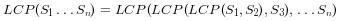 

**Algorithm**

 To employ this idea, the algorithm iterates through the strings ![\[S_1\ldotsS_n\] ](./p___S_1__ldots__S_n__.png) , finding at each iteration *i* the longest common prefix of strings 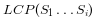  When   is an empty string, the algorithm ends. Otherwise after *n* iterations, the algorithm returns  .

 
 

 *Figure 1. Finding the longest common prefix (Horizontal scanning)*
 

 ```
 public String longestCommonPrefix(String[] strs) {
    if (strs.length == 0) return "";
    String prefix = strs[0];
    for (int i = 1; i < strs.length; i++)
        while (strs[i].indexOf(prefix) != 0) {
            prefix = prefix.substring(0, prefix.length() - 1);
            if (prefix.isEmpty()) return "";
        }        
    return prefix;
}
```

**Complexity Analysis**

* Time complexity : *O(S)* , where S is the sum of all characters in all strings.

    In the worst case all *n* strings are the same. The algorithm compares the string *S1* with the other strings ![\[S_2\ldotsS_n\] ](./p___S_2_ldots_S_n__.png)  There are *S* character comparisons, where *S* is the sum of all characters in the input array.

* Space complexity : *O(1)*. We only used constant extra space.
<br />
<br />
---
#### Approach 2: Vertical scanning

**Algorithm**

Imagine a very short string is at the end of the array. The above approach will still do *S* comparisons. One way to optimize this case is to do vertical scanning. We compare characters from top to bottom on the same column (same character index of  the strings) before moving on to the next column.

```
public String longestCommonPrefix(String[] strs) {
    if (strs == null || strs.length == 0) return "";
    for (int i = 0; i < strs[0].length() ; i++){
        char c = strs[0].charAt(i);
        for (int j = 1; j < strs.length; j ++) {
            if (i == strs[j].length() || strs[j].charAt(i) != c)
                return strs[0].substring(0, i);             
        }
    }
    return strs[0];
}
```

**Complexity Analysis**

* Time complexity : *O(S)* , where S is the sum of all characters in all strings.
In the worst case there will be *n* equal strings with length *m* and the algorithm performs  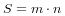  character comparisons.
Even though the worst case is still the same as [Approach 1](#approach-1-horizontal-scanning), in the best case there are at most 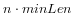  comparisons where *minLen* is the length of the shortest string in the array.
* Space complexity : *O(1)*. We only used constant extra space.
<br />
<br />
---
#### Approach 3: Divide and conquer

**Intuition**

The idea of the algorithm comes from the associative property of LCP operation. We notice that :
 
, where   is the longest common prefix in set of strings ![\[S_1\ldotsS_n\] ](./p___S_1_ldots_S_n__.png)  , *1 < k < n*

**Algorithm**

To apply the observation above, we use divide and conquer technique, where we split the   problem into two subproblems 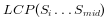    and 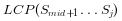 , where `mid` is 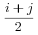 . We use their solutions `lcpLeft` and `lcpRight` to construct the solution of the main problem  . To accomplish this we compare one by one the characters of `lcpLeft` and `lcpRight` till there is no character match. The found common prefix of `lcpLeft` and `lcpRight` is the solution of the   .


*Figure 2. Finding the longest common prefix of strings using divide and conquer technique*


```
public String longestCommonPrefix(String[] strs) {
    if (strs == null || strs.length == 0) return "";    
        return longestCommonPrefix(strs, 0 , strs.length - 1);
}

private String longestCommonPrefix(String[] strs, int l, int r) {
    if (l == r) {
        return strs[l];
    }
    else {
        int mid = (l + r)/2;
        String lcpLeft =   longestCommonPrefix(strs, l , mid);
        String lcpRight =  longestCommonPrefix(strs, mid + 1,r);
        return commonPrefix(lcpLeft, lcpRight);
   }
}

String commonPrefix(String left,String right) {
    int min = Math.min(left.length(), right.length());       
    for (int i = 0; i < min; i++) {
        if ( left.charAt(i) != right.charAt(i) )
            return left.substring(0, i);
    }
    return left.substring(0, min);
}
```

**Complexity Analysis**

In the worst case we have *n* equal strings with length *m*

* Time complexity : *O(S)*, where *S* is the number of all characters in the array,  
 Time complexity is 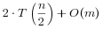 . Therefore time complexity is *O(S)*.
  In the best case this algorithm performs    comparisons, where  *minLen* is the shortest string of the array

* Space complexity : 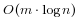 

    There is a memory overhead since we store recursive calls in the execution stack. There are 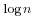  recursive calls, each store need *m* space to store the result,  so space complexity is  

<br />

---
#### Approach 4: Binary search

The idea is to apply binary search method to find the string with maximum value `L`, which is common prefix of all of the strings. The algorithm searches space is the interval 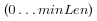 , where `minLen` is minimum string length and the maximum possible common prefix. Each time search space is divided in two equal parts, one of them is discarded, because it is sure that it doesn't contain the solution. There are two possible cases:
* `S[1...mid]` is not a common string. This means that for each `j > i S[1..j]` is not a common string and we discard the second half of the  search space.
* `S[1...mid]` is common string. This means that for for each `i < j S[1..i]` is a common string and we discard the first half of the search space, because we try to find longer common prefix.


*Figure 3. Finding the longest common prefix of strings using binary search technique*


```
public String longestCommonPrefix(String[] strs) {
    if (strs == null || strs.length == 0)
        return "";
    int minLen = Integer.MAX_VALUE;
    for (String str : strs)
        minLen = Math.min(minLen, str.length());
    int low = 1;
    int high = minLen;
    while (low <= high) {
        int middle = (low + high) / 2;
        if (isCommonPrefix(strs, middle))
            low = middle + 1;
        else
            high = middle - 1;
    }
    return strs[0].substring(0, (low + high) / 2);
}

private boolean isCommonPrefix(String[] strs, int len){
    String str1 = strs[0].substring(0,len);
    for (int i = 1; i < strs.length; i++)
        if (!strs[i].startsWith(str1))
            return false;
    return true;
}
```

**Complexity Analysis**

In the worst case we have *n* equal strings with length *m*

* Time complexity :  , where *S* is the sum of all characters in all strings.

    The algorithm makes   iterations, for each of them there are   comparisons, which gives in total   time complexity.

* Space complexity : *O(1)*. We only used constant extra space.
<br />
<br />
---
#### Further Thoughts / Follow up

Let's take a look at a slightly different problem:

> Given a set of keys S = ![\[S_1,S_2\ldotsS_n\] ](./p___S_1,S_2_ldots_S_n__.png) , find the longest common prefix among a string `q` and S. This LCP query will be called frequently.

We could optimize LCP queries by storing the set of keys S in a Trie. For more information about Trie, please see this article [Implement a trie (Prefix trie)](https://leetcode.com/articles/implement-trie-prefix-tree/). In a Trie, each node descending from the root represents a common prefix of some keys. But we need to find the longest common prefix of a string `q` and all key strings. This means that we have to find the deepest path from the root, which satisfies the following conditions:
* it is prefix of query string `q`
* each node along the path must contain only one child element. Otherwise the found path will not be a common prefix among all strings.
* the path doesn't comprise of nodes which are marked as end of key. Otherwise the path couldn't be a prefix a of key which is shorter than itself.

**Algorithm**

The only question left, is how to find the deepest path in the Trie, that fulfills the requirements above. The most effective way is to build a trie from ![\[S_1\ldotsS_n\] ](./p___S_1_ldots___S_n__.png)  strings. Then find the prefix of query string `q` in the Trie. We traverse the Trie from the root, till it is impossible to continue the path in the Trie because one of the conditions above is not satisfied.


*Figure 4. Finding the longest common prefix of strings using Trie*


```
public String longestCommonPrefix(String q, String[] strs) {
    if (strs == null || strs.length == 0)
         return "";  
    if (strs.length == 1)
         return strs[0];
    Trie trie = new Trie();      
    for (int i = 1; i < strs.length ; i++) {
        trie.insert(strs[i]);
    }
    return trie.searchLongestPrefix(q);
}

class TrieNode {

    // R links to node children
    private TrieNode[] links;

    private final int R = 26;

    private boolean isEnd;

    // number of children non null links
    private int size;    
    public void put(char ch, TrieNode node) {
        links[ch -'a'] = node;
        size++;
    }

    public int getLinks() {
        return size;
    }
    //assume methods containsKey, isEnd, get, put are implemented as it is described
   //in  https://leetcode.com/articles/implement-trie-prefix-tree/)
}

public class Trie {

    private TrieNode root;

    public Trie() {
        root = new TrieNode();
    }

//assume methods insert, search, searchPrefix are implemented as it is described
//in  https://leetcode.com/articles/implement-trie-prefix-tree/)
    private String searchLongestPrefix(String word) {
        TrieNode node = root;
        StringBuilder prefix = new StringBuilder();
        for (int i = 0; i < word.length(); i++) {
            char curLetter = word.charAt(i);
            if (node.containsKey(curLetter) && (node.getLinks() == 1) && (!node.isEnd())) {
                prefix.append(curLetter);
                node = node.get(curLetter);
            }
            else
                return prefix.toString();

         }
         return prefix.toString();
    }
}
```

**Complexity Analysis**

In the worst case query *q* has length *m* and it is equal to all *n* strings of the array.

* Time complexity : preprocessing *O(S)*, where *S* is the number of all characters in the array, LCP query *O(m)*.

    Trie build has *O(S)* time complexity. To find the common prefix of *q* in the Trie takes in the worst case *O(m)*.

* Space complexity : *O(S)*. We only used additional  *S* extra space for the Trie.